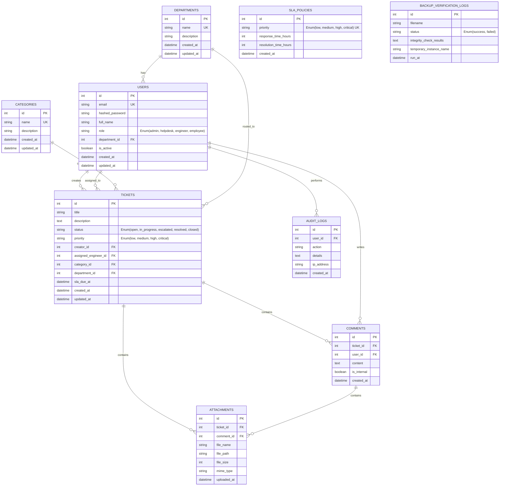

# Database Design Document

This document defines the schema, integrity constraints, indexes, and relationships for the **AWS-GCP Multi-Cloud Enterprise Ticket Management System** database. It aligns with **Chapter Three (Database Design)** of the MIVA postgraduate report guidelines.

---

## 1. Entity Relationship (ER) Diagram
The schema is designed in 3rd Normal Form (3NF) to minimize redundancy and prevent anomalies.



---

## 2. Table Definitions and Constraints

### 2.1. `departments`
Stores organizational department units for routing tickets and placing users.
* **Indexes**: Primary key `id`. Unique index on `name`.

### 2.2. `users`
Stores user credentials, roles, and profiles.
* **Indexes**: Primary key `id`. Unique index on `email`. Foreign key index on `department_id`.
* **Security Note**: Password hashes use the `Argon2id` hash value string (approx. 97 chars), stored as `VARCHAR(255)`.

### 2.3. `categories`
Categorization labels for tickets (e.g. Hardware, Network, Access Provisioning).
* **Indexes**: Primary key `id`. Unique index on `name`.

### 2.4. `sla_policies`
Tracks Service Level Agreements rules by priority index.
* **Indexes**: Primary key `id`. Unique index on `priority`.

### 2.5. `tickets`
The core entity storing ticket states, assignments, and metadata.
* **Constraints**:
  - `creator_id` cannot be null.
  - `assigned_engineer_id` is nullable (unassigned tickets).
  - Statuses: `open`, `in_progress`, `escalated`, `resolved`, `closed`.
  - Priorities: `low`, `medium`, `high`, `critical`.
* **Indexes**: Primary Key `id`. Foreign Key indexes on `creator_id`, `assigned_engineer_id`, `category_id`, `department_id`. Composite index on `status` and `priority` for optimized dashboard queues.

### 2.6. `comments`
Chronological discussion threads linked to tickets. Supports internal notes visible only to engineers/helpdesk.
* **Indexes**: Primary key `id`. Foreign Key indexes on `ticket_id`, `user_id`.

### 2.7. `attachments`
Stores references to media files hosted in S3 (AWS) or GCS (GCP).
* **Indexes**: Primary key `id`. Foreign Key indexes on `ticket_id`, `comment_id`.

---

## 3. SQL DDL Schema Script
Save this script as `schema.sql`.

```sql
-- MySQL DDL Schema Initializer
SET FOREIGN_KEY_CHECKS = 0;
DROP TABLE IF EXISTS `backup_verification_logs`;
DROP TABLE IF EXISTS `audit_logs`;
DROP TABLE IF EXISTS `attachments`;
DROP TABLE IF EXISTS `comments`;
DROP TABLE IF EXISTS `tickets`;
DROP TABLE IF EXISTS `sla_policies`;
DROP TABLE IF EXISTS `categories`;
DROP TABLE IF EXISTS `users`;
DROP TABLE IF EXISTS `departments`;
SET FOREIGN_KEY_CHECKS = 1;

-- 1. Departments Table
CREATE TABLE `departments` (
    `id` INT AUTO_INCREMENT PRIMARY KEY,
    `name` VARCHAR(100) NOT NULL UNIQUE,
    `description` VARCHAR(255) NULL,
    `created_at` DATETIME DEFAULT CURRENT_TIMESTAMP,
    `updated_at` DATETIME DEFAULT CURRENT_TIMESTAMP ON UPDATE CURRENT_TIMESTAMP
) ENGINE=InnoDB DEFAULT CHARSET=utf8mb4 COLLATE=utf8mb4_unicode_ci;

-- 2. Users Table
CREATE TABLE `users` (
    `id` INT AUTO_INCREMENT PRIMARY KEY,
    `email` VARCHAR(150) NOT NULL UNIQUE,
    `hashed_password` VARCHAR(255) NOT NULL,
    `full_name` VARCHAR(100) NOT NULL,
    `role` ENUM('admin', 'helpdesk', 'engineer', 'employee') NOT NULL,
    `department_id` INT NULL,
    `is_active` BOOLEAN DEFAULT TRUE,
    `created_at` DATETIME DEFAULT CURRENT_TIMESTAMP,
    `updated_at` DATETIME DEFAULT CURRENT_TIMESTAMP ON UPDATE CURRENT_TIMESTAMP,
    CONSTRAINT `fk_users_department` FOREIGN KEY (`department_id`) REFERENCES `departments` (`id`) ON DELETE SET NULL
) ENGINE=InnoDB DEFAULT CHARSET=utf8mb4 COLLATE=utf8mb4_unicode_ci;

-- 3. Categories Table
CREATE TABLE `categories` (
    `id` INT AUTO_INCREMENT PRIMARY KEY,
    `name` VARCHAR(100) NOT NULL UNIQUE,
    `description` VARCHAR(255) NULL,
    `created_at` DATETIME DEFAULT CURRENT_TIMESTAMP,
    `updated_at` DATETIME DEFAULT CURRENT_TIMESTAMP ON UPDATE CURRENT_TIMESTAMP
) ENGINE=InnoDB DEFAULT CHARSET=utf8mb4 COLLATE=utf8mb4_unicode_ci;

-- 4. SLA Policies Table
CREATE TABLE `sla_policies` (
    `id` INT AUTO_INCREMENT PRIMARY KEY,
    `priority` ENUM('low', 'medium', 'high', 'critical') NOT NULL UNIQUE,
    `response_time_hours` INT NOT NULL,
    `resolution_time_hours` INT NOT NULL,
    `created_at` DATETIME DEFAULT CURRENT_TIMESTAMP
) ENGINE=InnoDB DEFAULT CHARSET=utf8mb4 COLLATE=utf8mb4_unicode_ci;

-- 5. Tickets Table
CREATE TABLE `tickets` (
    `id` INT AUTO_INCREMENT PRIMARY KEY,
    `title` VARCHAR(150) NOT NULL,
    `description` TEXT NOT NULL,
    `status` ENUM('open', 'in_progress', 'escalated', 'resolved', 'closed') DEFAULT 'open',
    `priority` ENUM('low', 'medium', 'high', 'critical') DEFAULT 'medium',
    `creator_id` INT NOT NULL,
    `assigned_engineer_id` INT NULL,
    `category_id` INT NOT NULL,
    `department_id` INT NOT NULL,
    `sla_due_at` DATETIME NULL,
    `created_at` DATETIME DEFAULT CURRENT_TIMESTAMP,
    `updated_at` DATETIME DEFAULT CURRENT_TIMESTAMP ON UPDATE CURRENT_TIMESTAMP,
    CONSTRAINT `fk_tickets_creator` FOREIGN KEY (`creator_id`) REFERENCES `users` (`id`) ON DELETE CASCADE,
    CONSTRAINT `fk_tickets_engineer` FOREIGN KEY (`assigned_engineer_id`) REFERENCES `users` (`id`) ON DELETE SET NULL,
    CONSTRAINT `fk_tickets_category` FOREIGN KEY (`category_id`) REFERENCES `categories` (`id`) ON DELETE RESTRICT,
    CONSTRAINT `fk_tickets_department` FOREIGN KEY (`department_id`) REFERENCES `departments` (`id`) ON DELETE RESTRICT
) ENGINE=InnoDB DEFAULT CHARSET=utf8mb4 COLLATE=utf8mb4_unicode_ci;

CREATE INDEX `idx_tickets_status_priority` ON `tickets` (`status`, `priority`);
CREATE INDEX `idx_tickets_sla_due` ON `tickets` (`sla_due_at`);

-- 6. Comments Table
CREATE TABLE `comments` (
    `id` INT AUTO_INCREMENT PRIMARY KEY,
    `ticket_id` INT NOT NULL,
    `user_id` INT NOT NULL,
    `content` TEXT NOT NULL,
    `is_internal` BOOLEAN DEFAULT FALSE,
    `created_at` DATETIME DEFAULT CURRENT_TIMESTAMP,
    CONSTRAINT `fk_comments_ticket` FOREIGN KEY (`ticket_id`) REFERENCES `tickets` (`id`) ON DELETE CASCADE,
    CONSTRAINT `fk_comments_user` FOREIGN KEY (`user_id`) REFERENCES `users` (`id`) ON DELETE CASCADE
) ENGINE=InnoDB DEFAULT CHARSET=utf8mb4 COLLATE=utf8mb4_unicode_ci;

-- 7. Attachments Table
CREATE TABLE `attachments` (
    `id` INT AUTO_INCREMENT PRIMARY KEY,
    `ticket_id` INT NOT NULL,
    `comment_id` INT NULL,
    `file_name` VARCHAR(255) NOT NULL,
    `file_path` VARCHAR(512) NOT NULL,
    `file_size` INT NOT NULL,
    `mime_type` VARCHAR(100) NOT NULL,
    `uploaded_at` DATETIME DEFAULT CURRENT_TIMESTAMP,
    CONSTRAINT `fk_attachments_ticket` FOREIGN KEY (`ticket_id`) REFERENCES `tickets` (`id`) ON DELETE CASCADE,
    CONSTRAINT `fk_attachments_comment` FOREIGN KEY (`comment_id`) REFERENCES `comments` (`id`) ON DELETE SET NULL
) ENGINE=InnoDB DEFAULT CHARSET=utf8mb4 COLLATE=utf8mb4_unicode_ci;

-- 8. Audit Logs Table
CREATE TABLE `audit_logs` (
    `id` INT AUTO_INCREMENT PRIMARY KEY,
    `user_id` INT NULL,
    `action` VARCHAR(100) NOT NULL,
    `details` TEXT NOT NULL,
    `ip_address` VARCHAR(45) NOT NULL,
    `created_at` DATETIME DEFAULT CURRENT_TIMESTAMP,
    CONSTRAINT `fk_audit_logs_user` FOREIGN KEY (`user_id`) REFERENCES `users` (`id`) ON DELETE SET NULL
) ENGINE=InnoDB DEFAULT CHARSET=utf8mb4 COLLATE=utf8mb4_unicode_ci;

-- 9. Backup Verification Logs (DR reporting)
CREATE TABLE `backup_verification_logs` (
    `id` INT AUTO_INCREMENT PRIMARY KEY,
    `filename` VARCHAR(255) NOT NULL,
    `status` ENUM('success', 'failed') NOT NULL,
    `integrity_check_results` TEXT NOT NULL,
    `temporary_instance_name` VARCHAR(100) NOT NULL,
    `run_at` DATETIME DEFAULT CURRENT_TIMESTAMP
) ENGINE=InnoDB DEFAULT CHARSET=utf8mb4 COLLATE=utf8mb4_unicode_ci;
```

---

## 4. Sample Seed Data Script
Save this script as `seed.sql`. (Contains default credentials for role-based testing. Default passwords are set to `Password123` hashed with Argon2id values).

```sql
-- Initial Seed Data
SET FOREIGN_KEY_CHECKS = 0;
TRUNCATE TABLE `sla_policies`;
TRUNCATE TABLE `categories`;
TRUNCATE TABLE `users`;
TRUNCATE TABLE `departments`;
SET FOREIGN_KEY_CHECKS = 1;

-- 1. Seed Departments
INSERT INTO `departments` (`id`, `name`, `description`) VALUES
(1, 'IT Infrastructure', 'Handles networks, servers, and VPN connections'),
(2, 'Software Engineering', 'Handles application bugs and features development'),
(3, 'Human Resources', 'Handles employee onboarding and internal policies'),
(4, 'Finance', 'Handles accounting, billing, and procurement systems');

-- 2. Seed SLA Policies
INSERT INTO `sla_policies` (`id`, `priority`, `response_time_hours`, `resolution_time_hours`) VALUES
(1, 'low', 24, 72),
(2, 'medium', 12, 48),
(3, 'high', 4, 12),
(4, 'critical', 1, 4);

-- 3. Seed Categories
INSERT INTO `categories` (`id`, `name`, `description`) VALUES
(1, 'Hardware Outage', 'Laptops, monitors, keycards, or device failures'),
(2, 'Software Bug', 'System errors or crashes in internal tools'),
(3, 'Network & VPN', 'Wi-Fi issues, VPN tunnel drops, routing conflicts'),
(4, 'Identity & Access', 'Password resets, Active Directory lockers, email access requests');

-- 4. Seed Users (Argon2id Hash value of "Password123" used as default password)
-- Hash: $argon2id$v=19$m=65536,t=3,p=4$6FvFuh3mUoKk0T5119tLJA$P13kG5hJpEaWzNleD5T/NlJ7Jc41BfH0+9qHjD/F5L0
INSERT INTO `users` (`id`, `email`, `hashed_password`, `full_name`, `role`, `department_id`, `is_active`) VALUES
-- Admin User
(1, 'admin@verdad.com', '$argon2id$v=19$m=65536,t=3,p=4$6FvFuh3mUoKk0T5119tLJA$P13kG5hJpEaWzNleD5T/NlJ7Jc41BfH0+9qHjD/F5L0', 'Anna Administrator', 'admin', 1, 1),
-- Help Desk User
(2, 'helpdesk@verdad.com', '$argon2id$v=19$m=65536,t=3,p=4$6FvFuh3mUoKk0T5119tLJA$P13kG5hJpEaWzNleD5T/NlJ7Jc41BfH0+9qHjD/F5L0', 'Hal Helpdesk', 'helpdesk', 1, 1),
-- IT Engineers
(3, 'engineer1@verdad.com', '$argon2id$v=19$m=65536,t=3,p=4$6FvFuh3mUoKk0T5119tLJA$P13kG5hJpEaWzNleD5T/NlJ7Jc41BfH0+9qHjD/F5L0', 'Edward Engineer', 'engineer', 1, 1),
(4, 'engineer2@verdad.com', '$argon2id$v=19$m=65536,t=3,p=4$6FvFuh3mUoKk0T5119tLJA$P13kG5hJpEaWzNleD5T/NlJ7Jc41BfH0+9qHjD/F5L0', 'Elena Engineer', 'engineer', 2, 1),
-- Employees
(5, 'employee1@verdad.com', '$argon2id$v=19$m=65536,t=3,p=4$6FvFuh3mUoKk0T5119tLJA$P13kG5hJpEaWzNleD5T/NlJ7Jc41BfH0+9qHjD/F5L0', 'Emeka Employee', 'employee', 3, 1),
(6, 'employee2@verdad.com', '$argon2id$v=19$m=65536,t=3,p=4$6FvFuh3mUoKk0T5119tLJA$P13kG5hJpEaWzNleD5T/NlJ7Jc41BfH0+9qHjD/F5L0', 'Esosa Employee', 'employee', 4, 1);

-- 5. Seed Demonstration Tickets
INSERT INTO `tickets` (`id`, `title`, `description`, `status`, `priority`, `creator_id`, `assigned_engineer_id`, `category_id`, `department_id`, `sla_due_at`) VALUES
(1, 'Critical Network Outage in Lagos Office', 'The primary Cisco switch is showing solid red amber lights, and all Ethernet drops are offline.', 'escalated', 'critical', 5, NULL, 3, 1, DATE_ADD(NOW(), INTERVAL 1 HOUR)),
(2, 'Database Access Credentials Lockout', 'I am locked out of the finance staging database after 3 incorrect attempts. Need credentials reset.', 'in_progress', 'high', 6, 3, 4, 4, DATE_ADD(NOW(), INTERVAL 12 HOUR)),
(3, 'Printer installation driver issues', 'Unable to connect my local laptop to the office color printer.', 'open', 'low', 5, NULL, 1, 1, DATE_ADD(NOW(), INTERVAL 72 HOUR));

-- 6. Seed Ticket Discussion Comments
INSERT INTO `comments` (`id`, `ticket_id`, `user_id`, `content`, `is_internal`) VALUES
(1, 1, 5, 'Switch rebooted manually, but port link lights remain unlit.', 0),
(2, 1, 2, 'Helpdesk escalated this critical network ticket to the IT Infrastructure team for physical check.', 1),
(3, 2, 3, 'Verifying identification details. Resubmitting authorization check to finance Lead.', 1),
(4, 2, 3, 'Access restored, please attempt login using the temporary credentials sent to your email.', 0);
```
