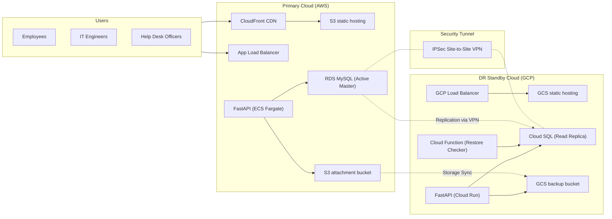

# MASTER OF INFORMATION TECHNOLOGY (MIT) PROFESSIONAL MASTER’S PROJECT PROPOSAL

---

## 1. Title of Project
**Design and Implementation of a Secure AWS-GCP Multi-Cloud Enterprise Ticket Management System with IPSec VPN and Active Database Replication for Verdad Solutions**

---

## 2. Background to the Study
In modern enterprise operations, the efficiency of IT Service Management (ITSM) directly correlates with organizational productivity and operational uptime. Verdad Solutions, a rapidly expanding professional services firm, relies heavily on its digital workplace to support distributed offices and remote workers. However, the company currently lacks a centralized, secure system for managing internal technical support requests. IT support issues are currently handled via fragmented channels—namely emails, instant messages, and informal verbal communications. This results in requests being lost, delayed resolutions, lack of technician accountability, and no clear visibility into service delivery metrics (such as SLA compliance).

To address these challenges, Verdad Solutions requires a centralized, web-based Ticket Management System that adheres to ITIL (IT Infrastructure Library) framework principles. Crucially, as an enterprise application handling sensitive operational data, internal system logs, and security-relevant configuration data, the system must be secure, compliant, and highly resilient. Because a system outage could freeze internal operations, the infrastructure must not have a single point of failure (SPOF). This project proposes hosting the primary production environment on Amazon Web Services (AWS) with a secondary warm standby disaster recovery (DR) environment on Google Cloud Platform (GCP).

---

## 3. Statement of the Problem
Legacy ITSM tools and single-cloud system architectures face several severe limitations that directly impact business continuity and security posture:
1. **Infrastructure Vulnerability (Single-Cloud SPOF)**: Storing and running applications within a single cloud provider’s region makes the organization highly susceptible to localized cloud service disruptions or region-wide outages.
2. **Data Loss Risks (Stale Backups)**: Traditional disaster recovery designs rely on simple daily or nightly database snapshots. In the event of a catastrophic failure, restoring from a 24-hour-old backup results in significant data loss, violating standard enterprise Recovery Point Objectives (RPO).
3. **Network Eavesdropping and Unencrypted Replication**: Transmitting database replication payloads or administrative commands across the public internet between cloud providers exposes sensitive data (e.g., system credentials, vulnerability reports, personal employee data) to network intercepts.
4. **Poor Routing Efficiency**: Fragmented communications prevent support tickets from being systematically prioritized, assigned, and escalated, leading to breaches in Service Level Agreements (SLAs) and decreased employee productivity.

---

## 4. Aim and Objectives of the Project
### Aim
The overall purpose of this project is to design, implement, and evaluate a secure, web-based multi-cloud Enterprise Ticket Management System for Verdad Solutions that ensures zero data loss and minimal downtime through an active database replication link over a secure IPSec Site-to-Site VPN between AWS and GCP.

### Objectives
1. **Centralized Portal & RBAC**: Develop a modern web application supporting four distinct roles (Admin, Help Desk Officer, IT Support Engineer, Employee) with strict Role-Based Access Control (RBAC).
2. **Secure Authentication & Hashing**: Implement JWT session tokens and Argon2id cryptographically hashed passwords to secure APIs and authentication flows.
3. **Cross-Cloud IPSec VPN**: Design and configure a secure **IPSec Site-to-Site VPN tunnel** to connect the AWS VPC and GCP VPC, isolating all database replication traffic from the public internet.
4. **Near-Real-Time Database Replication**: Implement active **MySQL Binlog Replication** from the primary AWS RDS database to the standby GCP Cloud SQL database over the VPN tunnel, satisfying a **15-minute RPO**.
5. **DNS-Based Automatic Failover**: Configure a multi-cloud traffic routing setup (e.g., Cloudflare or Route 53 failover) that redirects traffic to the GCP standby backend in less than **30 minutes (RTO)** during a primary site failure.
6. **Automated Backup Verification**: Develop a serverless validation pipeline (using Google Cloud Functions) to automatically restore and verify the integrity of GCP database backups daily.

---

## 5. Scope of the Project
### Within Scope
* **Modules**: Authentication, User Management, Employee Ticket Submission, Help Desk Routing & Escalation, IT Support Ticket Resolution, Reporting/Analytics, Knowledge Base, and Audit Logging.
* **Architecture**: AWS VPC and GCP VPC connected via a Site-to-Site VPN, utilizing RDS MySQL, Cloud SQL, S3, GCS, ECS Fargate, and Google Cloud Run.
* **Scope of Replication**: Binlog database transactions and S3-to-GCS media synchronization.

### Out of Scope
* Integration with external public-facing customers (limited strictly to internal employees).
* Telephony or voice support system integrations (IVR).
* Billing, invoicing, or hardware procurement payment gateways.

---

## 6. Significance of the Project
* **Benefits to Industry & Organizations**: Provides a practical, cost-effective framework for mid-sized enterprises to achieve cloud-agnostic high availability. The warm standby architecture using serverless container hosting (Cloud Run) minimizes idle infrastructure costs.
* **Benefits to the Nigerian Context**: Highlights secure, resilient cloud architecture principles relevant to the growing Nigerian financial services and tech startups sector, where local data compliance and minimal system downtime are heavily regulated.
* **Contribution to Professional IT Practice**: Demonstrates the practical integration of secure network routing (IPSec VPN), cross-cloud real-time database replication, and zero-trust authentication (JWT/Argon2id) in a single deployed application.

---

## 7. Preliminary Literature Review and Technology Context
### Cloud Architecture Patterns for Disaster Recovery
Disaster recovery architectures in distributed systems generally fall into three categories: Cold Standby, Warm Standby, and Hot Standby (Active-Active). 
* *Cold Standby* requires launching resources from scratch after an outage occurs, causing high RTOs (hours). 
* *Active-Active Hot Standby* achieves near-zero RTO but introduces massive transactional latency overhead and split-brain sync risks. 
* *Warm Standby* (Active-Passive) is the industry sweet spot for database systems. The passive cloud runs low-footprint services that scale up instantly during failover.

### Multi-Cloud Interconnectivity & Replication
Active replication across distinct cloud networks requires secure transport. Exposing MySQL ports (`3306`) over public IP addresses violates standard security practices. The literature recommends establishing a virtual private network. A **Site-to-Site IPSec VPN** encapsulates packets within encrypted ESP (Encapsulating Security Payload) tunnels. Using Google Cloud's external master replication, MySQL binlogs are securely streamed through the VPN tunnel to GCP Cloud SQL, mitigating security risks.

### Identified Gaps in Current Architectures
Many existing multi-cloud solutions fail to automate **backup verification**. Backups are often written to storage buckets but never restored to check for corruption. This project bridges that gap by implementing a serverless verification script that performs automated, periodic test restores to guarantee database health.

---

## 8. Proposed Methodology
This project adopts the **Agile Iterative Development Methodology**. This approach organizes implementation into short, manageable sprints (phases), allowing for incremental code writing, testing, and continuous feedback. 

```
Sprint 1: Requirements & DB Modeling (Phases 1-4)
Sprint 2: UI/UX & API Foundations (Phases 5-7)
Sprint 3: Core App Modules (Phases 8-16)
Sprint 4: Security Review & Cloud Infrastructure (Phases 17-20)
Sprint 5: Testing, Validation & Documentation (Phases 21-22)
```

Agile is chosen because it allows rapid iteration on the React frontend and FastAPI backend in parallel, ensuring that system dependencies remain integrated and functional at the end of each iteration.

---

## 9. Proposed System Overview / Solution Approach
The solution is structured as a multi-cloud distributed system:



### Key Modules:
* **Employee portal**: Submit tickets, view logs, respond to notes.
* **Help Desk dashboard**: Classify, prioritize, assign, and escalate tickets.
* **Engineer view**: Resolve tickets, submit technical comments, write SLA notes.
* **Administrator console**: Manage users, configure SLA rules, check backup/replication logs.

---

## 10. Tools and Technologies to be Used
* **Backend Framework**: Python FastAPI (selected for high performance, standard async support, and automatic OpenAPI schema generation).
* **Frontend Framework**: React.js built with Vite, styled with Tailwind CSS for a premium responsive UI.
* **Database**: MySQL 8.0, utilizing SQLAlchemy ORM and Alembic migrations.
* **Security & Auth**: PyJWT (JSON Web Tokens) and Passlib (Argon2id hashing).
* **Infrastructure**: AWS (RDS, S3, ECS, CloudFront, Virtual Private Gateway), GCP (Cloud SQL, Cloud Storage, Cloud Run, Cloud Router, Cloud VPN Gateway).
* **Local Simulation**: Docker Compose, LocalStack (S3 simulation), and private Docker network topologies.

---

## 11. Feasibility Considerations
* **Technical Feasibility**: Python FastAPI and React.js are highly mature and supported. Cloud VPN configurations between AWS and GCP are standardized and fully documented.
* **Resource Feasibility**: The development is simulated locally via containerization (Docker Compose) and tested sequentially, bypassing the immediate need for paid active physical hardware.
* **Constraints and Assumptions**: It is assumed that the network link between AWS and GCP maintains latency under 100ms to prevent binlog replication lag.

---

## 12. Project Plan And Timeline
The development timeline runs across a 6-month sequence:

| Milestone / Activity | Month 1 | Month 2 | Month 3 | Month 4 | Month 5 | Month 6 |
| :--- | :---: | :---: | :---: | :---: | :---: | :---: |
| **Requirements & Design (Phases 1-5)** | [========] | | | | | |
| **DB & API Definition (Phases 6-7)** | | [========] | | | | |
| **Backend & Frontend Coding (Phases 8-11)** | | | [========] | | | |
| **Dashboard, Reports & Loggers (Phases 12-16)** | | | | [========] | | |
| **VPN Setup, DR & Failover Testing (Phases 17-20)** | | | | | [========] | |
| **Final Evaluation & Reports (Phases 21-22)** | | | | | | [========] |

---

## 13. Expected Deliverables
1. **Source Code**: Dockerized React frontend and FastAPI backend.
2. **Database Scripts**: Schema creation scripts, migration files, and realistic sample data.
3. **Disaster Recovery Scripts**: Replication health check script, failover simulation automation, and GCS sync configs.
4. **Documentation Reports**:
   - Software Requirements Specification (SRS)
   - Database Design Document (including ERDs)
   - Administrator and User Manuals
   - Final Project Report (Academic Chapters 1 to 6)

---

## 14. References
1. Kleppmann, M. (2017). *Designing Data-Intensive Applications: The Big Ideas Behind Reliable, Scalable, and Maintainable Systems*. O'Reilly Media.
2. Tanenbaum, A. S., & Van Steen, M. (2017). *Distributed Systems: Principles and Paradigms*. CreateSpace.
3. AWS. (2024). *Disaster Recovery of Workloads on AWS: Recovery in the Cloud*. AWS Whitepaper.
4. Google Cloud. (2024). *Hybrid and Multi-Cloud Architecture Patterns*. Google Cloud Solution Guides.
