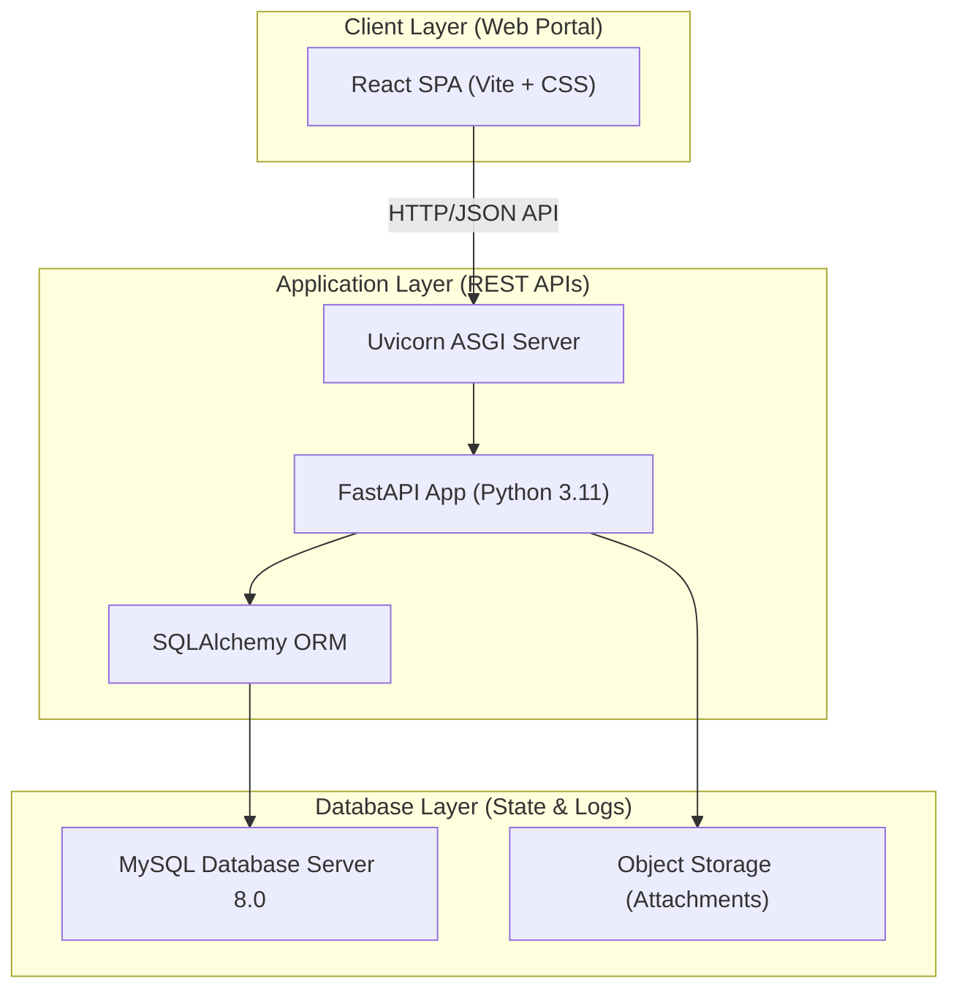
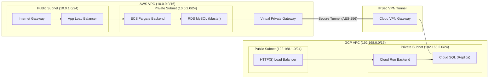
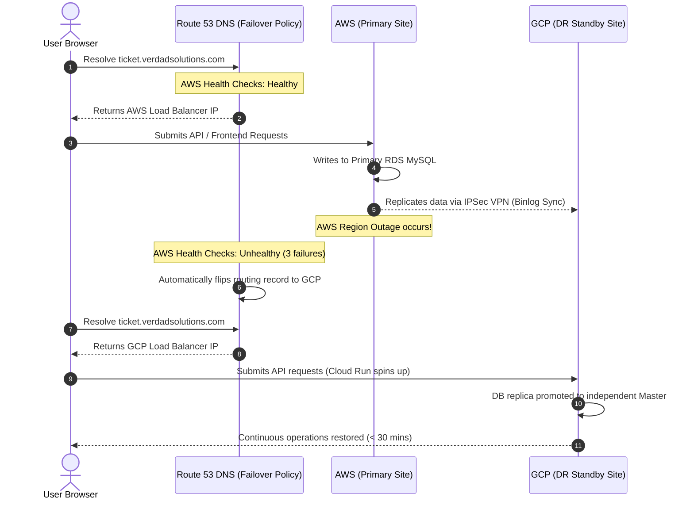

# System Architecture and Design Document

This document outlines the detailed system, network, and security architecture for the **AWS-GCP Multi-Cloud Enterprise Ticket Management System**. It aligns with **Chapter Three (Methodology and System Design)** of the MIVA postgraduate report regulations.

---

## 1. System Architecture Overview
The system follows a decoupled, three-tier architecture (Client, Application, and Database layers) utilizing modern containerized web patterns.

### Components
1. **Frontend**: Single Page Application (SPA) built using React.js and compiled using Vite. It handles state management (via Context API) and UI layout (using Tailwind CSS for responsive design).
2. **Backend**: Async REST API powered by Python FastAPI, run by Uvicorn. It handles input validation (via Pydantic), business logic (tickets, SLA, comments), and data persistence mapping.
3. **Database**: MySQL 8.0 database engine. Data objects are mapped dynamically via SQLAlchemy ORM.

---

## 2. Network Design (Multi-Cloud VPC)
To guarantee strict network-level isolation, all compute and database systems run within dedicated Virtual Private Clouds (VPCs) across AWS and GCP, linked via a secure IPSec tunnel.

### Network Topology Specs
1. **Subnet Isolation**:
   - Databases (RDS / Cloud SQL) and backend containers (ECS / Cloud Run serverless connectors) are deployed in **strictly private subnets** with no public IP addresses assigned.
   - Public traffic enters only through Elastic Application Load Balancers (ALBs) or Google HTTP(S) Load Balancers configured with strict TLS 1.3 certificates.
2. **AWS-GCP Site-to-Site VPN**:
   - **AWS Setup**: AWS Virtual Private Gateway (VGW) attached to the AWS VPC, with a Customer Gateway (CGW) referencing GCP's public VPN gateway IP.
   - **GCP Setup**: GCP Cloud VPN Gateway (HA VPN) with dual tunnels attached to a Cloud Router to handle dynamic BGP routing.
   - **Encryption**: IPSec IKEv2 configuration with AES-GCM-256 for data encryption, SHA-256 for integrity check, and Diffie-Hellman Group 14 for key exchanges.

---

## 3. Cloud Architecture & Failover Strategy
The system operates in a **Warm Standby (Active-Passive)** configuration to balance resilience with cost efficiency.

### Data Replication Mechanics
* **Database (MySQL)**: Standard MySQL asynchronous replication. The GCP Cloud SQL instance is configured as a Read Replica pointing to the AWS RDS instance as its master. Since all replication traffic flows through the encrypted Site-to-Site VPN, latency remains low, keeping replication lag under 1 second.
* **File Storage (Attachments)**: S3 bucket event notifications trigger an AWS Lambda function that replicates new files to the GCP GCS bucket using GCP service account credentials. A secondary scheduled check runs hourly to catch any missed transfers.

---

## 4. Security Architecture
A zero-trust model is applied across all network layers and code logic.

### 4.1. Identity & Access Management (RBAC)
Every endpoint requires explicit authorization. The application maps users to one of four roles:
* **Administrator**: Full read/write access to user management, team definitions, audit logs, SLA configurations, and system backups.
* **Help Desk Officer**: Access to the general incoming queue. Can view all tickets, assign technicians, update priority, and escalate tickets.
* **IT Support Engineer**: Can read assigned tickets, submit technician resolution comments, modify ticket statuses to resolved/closed.
* **Employee**: Submit tickets, view their own ticket history, and upload attachments.

### 4.2. Token-Based Authentication (JWT)
* Upon login, the backend signs a JWT access token containing the user's ID, role, and email.
* Access tokens are short-lived (expiry = 15 minutes) and are stored in client memory.
* Refresh tokens are stored in secure, `HttpOnly`, `SameSite=Strict`, `Secure` cookies to prevent Cross-Site Scripting (XSS) and Cross-Site Request Forgery (CSRF).

### 4.3. Cryptographic Password Hashing (Argon2id)
Passwords are encrypted using the Argon2id hashing algorithm, conforming to OWASP guidelines:
* **Parameters**:
  - Memory: 65,536 KB (64 MB)
  - Iterations (Time): 3 passes
  - Parallelism: 4 threads
  - Salt: 16-byte random cryptographically secure string generated per password.

### 4.4. Data Protection
* **In-Transit**: HTTPS enforced globally. Public endpoints support TLS 1.2 and TLS 1.3 only, with weak ciphers disabled.
* **At-Rest**: RDS MySQL, Cloud SQL disks, and AWS S3/GCP GCS buckets are encrypted using AES-256 keys managed by AWS KMS and GCP KMS.

---

## 5. Disaster Recovery Specs

| Metric | Target Objective | Technical Implementation |
| :--- | :--- | :--- |
| **RPO** (Recovery Point Objective) | **15 Minutes** | Active MySQL replication streaming binlogs over VPN. Actual data loss is expected to be < 5 seconds. |
| **RTO** (Recovery Time Objective) | **30 Minutes** | Cloud Run instances automatically spin up from 0 to target containers. DNS failover flips records in under 3 minutes. Total recovery takes < 5 minutes. |

### GCP Backup Verification Automation
To ensure the viability of backups, we use a daily Google Cloud Function:
1. Triggered via Cloud Scheduler daily at 02:00 AM.
2. Spins up a lightweight ephemeral Cloud SQL replica instance.
3. Restores the latest daily backup snapshot onto the instance.
4. Executes check queries (e.g., table structure validations, verifying active users count is > 0).
5. Writes the success status to the `backup_verification_logs` database table.
6. Automatically destroys the temporary Cloud SQL replica to avoid unnecessary cloud charges.
