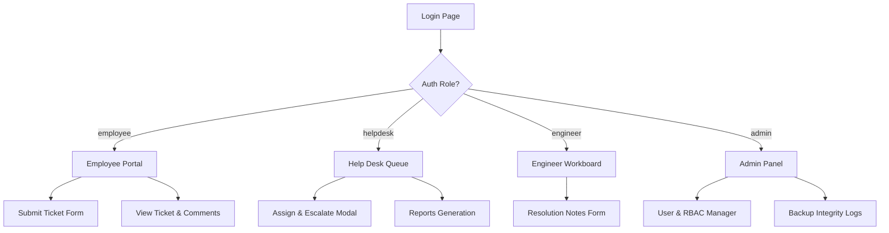

# UI/UX Design System Document

This document outlines the design language, color tokens, layout hierarchy, and reusable CSS components for the **AWS-GCP Multi-Cloud Enterprise Ticket Management System**. It ensures the frontend looks premium, modern, and intuitive.

---

## 1. Color Palette and Design System Tokens
To avoid generic/flat styling, we define a curated dark-accent-based color palette using HSL CSS variables. This supports light and dark modes out-of-the-box.

### CSS Theme Variables (`index.css`)
```css
:root {
  /* Color System */
  --bg-primary: #f8fafc;        /* Slate 50 (Page background) */
  --bg-secondary: #ffffff;      /* Card / Modal background */
  --bg-sidebar: #0f172a;        /* Slate 900 (Deep navy sidebar) */
  
  --text-primary: #0f172a;      /* Slate 900 */
  --text-secondary: #475569;    /* Slate 600 */
  --text-light: #94a3b8;        /* Slate 400 */
  
  --brand-primary: #4f46e5;     /* Indigo 600 (Core actions) */
  --brand-hover: #4338ca;       /* Indigo 700 */
  --brand-light: #e0e7ff;       /* Indigo 100 */
  
  /* Status Colors */
  --color-open: #06b6d4;        /* Cyan 500 */
  --color-progress: #3b82f6;    /* Blue 500 */
  --color-escalated: #f59e0b;  /* Amber 500 */
  --color-resolved: #10b981;    /* Emerald 500 */
  --color-closed: #64748b;      /* Slate 500 */
  --color-critical: #ef4444;    /* Red 500 */
  
  /* UI Tokens */
  --radius-sm: 0.375rem;
  --radius-md: 0.5rem;
  --radius-lg: 0.75rem;
  --shadow-sm: 0 1px 2px 0 rgb(0 0 0 / 0.05);
  --shadow-md: 0 4px 6px -1px rgb(0 0 0 / 0.1), 0 2px 4px -2px rgb(0 0 0 / 0.1);
  --shadow-lg: 0 10px 15px -3px rgb(0 0 0 / 0.1), 0 4px 6px -4px rgb(0 0 0 / 0.1);
  --font-sans: 'Inter', system-ui, -apple-system, sans-serif;
}

[data-theme="dark"] {
  --bg-primary: #0b0f19;
  --bg-secondary: #131c2e;
  --bg-sidebar: #070c14;
  --text-primary: #f1f5f9;
  --text-secondary: #94a3b8;
  --text-light: #64748b;
  --brand-light: #1e1b4b;
}
```

---

## 2. Layout Architecture & Navigation Grid
The application layout is structured as a full-viewport, split-screen container:

```
+--------------------------------------------------------------+
| [M] Logo   | Top Navigation (Search, Alerts, Profile)        |
+------------+-------------------------------------------------+
| Sidebar    | Content Area                                    |
| - Dash     | +---------------------------------------------+ |
| - Queue    | | Stats Cards                                  | |
| - Tickets  | +---------------------------------------------+ |
| - Users    | | Data Table (Paginated list of tickets)       | |
| - KB       | |                                             | |
| - Settings | |                                             | |
|            | +---------------------------------------------+ |
+------------+-------------------------------------------------+
```

### Component Breakdown
1. **Collapsible Sidebar**:
   - Stays locked at `w-64` on desktop, shrinks to icons or moves to off-canvas drawer on mobile devices (`max-width: 768px`).
   - Deep navy background (`--bg-sidebar`) to highlight separation from clean dashboard content.
2. **Top Navigation Header**:
   - Houses global search input (triggers filter across ticket queues).
   - Dynamic profile menu displaying user avatar, full name, and badge indicating active role.
   - Notifications bell showing unread ticket comments or SLA alerts count.

---

## 3. Core Component Designs

### 3.1. Stats Cards
Used at the top of employee/technician dashboards to give quick counts.
```html
<div class="stats-grid">
  <!-- Card Template -->
  <div class="stats-card">
    <div class="stats-icon text-cyan">📁</div>
    <div class="stats-info">
      <span class="stats-label">Open Tickets</span>
      <h3 class="stats-value">12</h3>
    </div>
  </div>
</div>
```

### 3.2. Responsive Data Tables
Renders active ticket lists with responsive scrolling, dynamic badges, and actions.
* Column structure: `ID` (clickable link), `Title`, `Priority` (colored text), `Status` (badge background), `Assigned Engineer`, `SLA Due`, `Actions`.
* Hover state: Soft background shift and scale transitions to invite click actions.

### 3.3. Dynamic Status Badges (Tailwind / Custom classes)
```css
.badge {
  display: inline-flex;
  align-items: center;
  padding: 0.125rem 0.625rem;
  font-size: 0.75rem;
  font-weight: 600;
  border-radius: 9999px;
  text-transform: capitalize;
}

.badge-open      { background-color: rgba(6, 182, 212, 0.1); color: var(--color-open); }
.badge-progress  { background-color: rgba(59, 130, 246, 0.1); color: var(--color-progress); }
.badge-escalated { background-color: rgba(245, 158, 11, 0.1); color: var(--color-escalated); }
.badge-resolved  { background-color: rgba(16, 185, 129, 0.1); color: var(--color-resolved); }
.badge-closed    { background-color: rgba(100, 116, 139, 0.1); color: var(--color-closed); }
.badge-critical  { background-color: rgba(239, 68, 68, 0.1); color: var(--color-critical); }
```

---

## 4. UI Screens Mockups and User Flows



### 4.1. Screen Layout Details
1. **Login Page**:
   - Sleek centermed box with modern glassmorphism backdrops.
   - Clean forms for email inputs, secure passwords, and password resets.
2. **Employee Dashboard**:
   - Prominent button labeled **"+ Submit New Ticket"**.
   - Grid showing employee stats ("My Open Tickets", "Recently Resolved").
   - Paginated list of user-created tickets.
3. **Help Desk Portal**:
   - High-density ticket queue highlighting priority badges and SLA deadlines.
   - Dropdown selects to quickly assign or transfer engineers.
4. **IT Support Board**:
   - Filtered directly to "My Assigned Tickets".
   - Split-view details page showing conversation comments on the left, and SLA/resolution settings panel on the right.
5. **Admin panel**:
   - Grid listing active users and current roles.
   - Section showing GCP multi-cloud **DR health status** and last backup verification log details.
